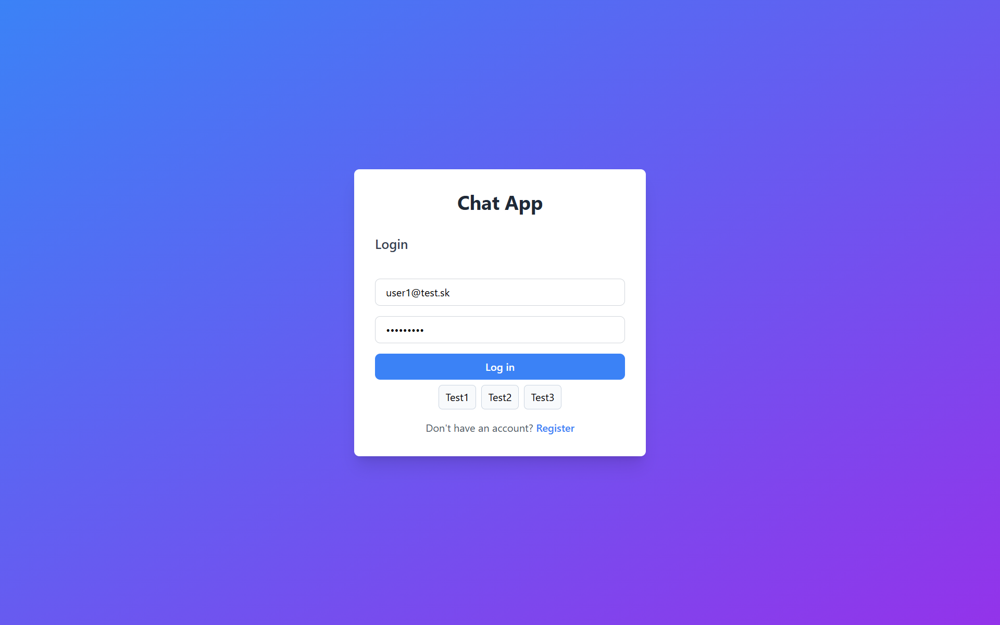

# Node.js Sample Chat App



A real-time chat application built with **Node.js**, **Express**, **Socket.IO**, and **PostgreSQL**. Features JWT authentication via HTTP-only cookies, real-time messaging, direct chats, group rooms, and message editing/deletion.

## What does it do?

This chat application allows users to:
- **Register & Login** with email and password
- **Create group chat rooms** or start **direct chats** with other users by email
- **Send, edit, and delete messages** in real-time
- **Receive live updates** when new messages arrive, or when messages are edited/deleted
- **Persistent message history** stored in PostgreSQL
- **View timestamps** for each message
- **Add members** to group rooms by email

## Authentication & Security

- **JWT Authentication**: Uses JSON Web Tokens (JWT) for user authentication
- **HTTP-only Cookies**: Auth tokens are stored in HTTP-only cookies (secure, resistant to XSS attacks)
- **Password Hashing**: Passwords are hashed using bcrypt
- **CORS & Helmet**: API security middleware for cross-origin requests and HTTP headers
- **Socket.IO Auth**: Real-time connections are verified via JWT token parsing

## Features
- Real-time bidirectional communication using **Socket.IO**
- Persistent message storage in **PostgreSQL** database
- Edit and delete messages with live socket updates
- Direct messaging and group rooms
- Member management (add users by email)
- Auto-generated API documentation using **Swagger**
- Containerized database setup using **Docker Compose**

## Prerequisites
Before you begin, ensure you have the following installed on your machine:
- [Node.js](https://nodejs.org/en/) (v16+ recommended)
- [Docker](https://www.docker.com/) & Docker Compose

## Installation & Setup

1. **Clone the repository**
   ```bash
   git clone https://github.com/kamesprojects/nodejs-sample-chat-app.git
   cd nodejs-sample-chat-app
   ```

2. **Install dependencies**
   ```bash
   npm install
   ```

3. **Environment Variables**
   Create a `.env` file in the root directory and add the following configuration:
   ```properties
   NODE_PORT=
   DB_PORT=
   DB_USER=
   DB_PASSWORD=
   DB_NAME=
   ```

## Running the Application

### Option 1: Start the application in Docker

```bash
# Run in detached mode (background)
docker-compose up -d
```

The application will be accessible at `http://localhost:${NODE_PORT}`.

## Debug Commands

Use these commands when you need to inspect or repair the Docker setup.

### Check Compose and container state

```bash
docker compose config
docker compose ps
docker ps -a
docker volume ls
```

### Build and start the stack

```bash
docker compose build
docker compose up -d
docker compose up -d --build
```

If you changed only source files and the app uses the bind mount already in `docker-compose.yml`, this is usually enough:

```bash
docker compose up -d
```

### Restart or stop containers

```bash
docker compose restart node-server
docker compose restart postgres-db
docker compose down
docker compose down -v
```

### Inspect logs

```bash
docker compose logs node-server
docker compose logs postgres-db
docker logs nodejs-sample-chat-app-node-server-1
docker logs my_postgres_container_name
```

### Verify the app from the host

```bash
curl -i http://localhost:3000/health
curl -i http://localhost:3000/
```

### Enter PostgreSQL and run SQL

```bash
docker compose exec postgres-db psql -U ${DB_USER} -d ${DB_NAME}
docker exec -it my_postgres_container_name psql -U ${DB_USER} -d ${DB_NAME}
docker compose exec postgres-db psql -U ${DB_USER} -d ${DB_NAME} -c "SELECT NOW();"
docker compose exec postgres-db psql -U ${DB_USER} -d ${DB_NAME} -c "SELECT * FROM messages LIMIT 5;"
```

Common `psql` flags:

- `-h` = host. Use it when connecting from your machine, for example `-h localhost`.
- `-p` = port. In this project the published port is ${DB_PORT}.
- `-U` = user. This comes from `.env`, for example ${DB_USER}.
- `-d` = database name. This also comes from `.env`, for example ${DB_NAME}.
- `-c` = run one SQL command and exit.

Example from your machine:

```bash
psql -h localhost -p 5431 -U ${DB_USER} -d ${DB_NAME}
psql -h localhost -p 5431 -U ${DB_USER} -d ${DB_NAME} -c "SELECT NOW();"
```

If `psql` asks for a password, type the value from `.env`, which is `DB_PASSWORD`.

How to exit `psql`:

```bash
\q
```

You can also press `Ctrl+D` to leave the `psql` shell.

Common `docker compose exec` / `docker exec` flags:

- `exec` = run a command inside a running container.
- `-it` = interactive terminal. Use this when you want to type SQL manually.
- `postgres-db` = the Compose service name for the PostgreSQL container.
- `my_postgres_container_name` = the explicit container name used in this project.

If you prefer connecting from WSL or your host with a local `psql` client, use the published port from `.env`:

```bash
psql -h localhost -p 5431 -U ${DB_USER} -d ${DB_NAME}
```

### Reset the database volume

The current PostgreSQL data volume in `docker-compose.yml` is `postgres_data_v2`.

```bash
docker compose down
docker volume rm nodejs-sample-chat-app_postgres_data_v2
docker compose up -d
```

If you only want to remove the old unused volume, use:

```bash
docker volume rm nodejs-sample-chat-app_postgres_data
```

Common `docker compose` flags used in this project:

- `up` = create and start containers.
- `-d` = detached mode, run in the background.
- `--build` = rebuild images before starting.
- `down` = stop and remove containers and networks.
- `-v` with `down` = also remove volumes, which resets the database.

### Option 2: Run only the database in Docker and start Node.js locally

```bash
   docker-compose up -d postgres-db
```

### 2. Generate Swagger Docs (Optional)
If you made changes to the endpoints, regenerate the `swagger-output.json` file:
```bash
npm run swagger
```

### 3. Start the Node.js Server

```bash
npm start
```
The server will start on `http://localhost:${NODE_PORT}`.

## API Documentation
Once the server is running, you can access the Swagger UI documentation at:
- **Swagger UI:** [http://localhost:${NODE_PORT}/api-docs](http://localhost:${NODE_PORT}/api-docs)

## Useful Docker Commands

- **Stop the containers:**
  ```bash
  docker-compose down
  ```
- **Stop and remove containers, networks, and volumes** (Use this to wipe the database data):

  ```bash
  docker-compose down -v
  ```
  
   *(The `-v` flag removes the current PostgreSQL volume, which is `postgres_data_v2` in this project, and resets the database.)*

## Tech Stack
- **Backend:** Node.js, Express.js
- **WebSockets:** Socket.IO
- **Database:** PostgreSQL (via `pg-promise`)
- **Documentation:** Swagger UI Express, Swagger Autogen
- **DevOps:** Docker, Docker Compose
